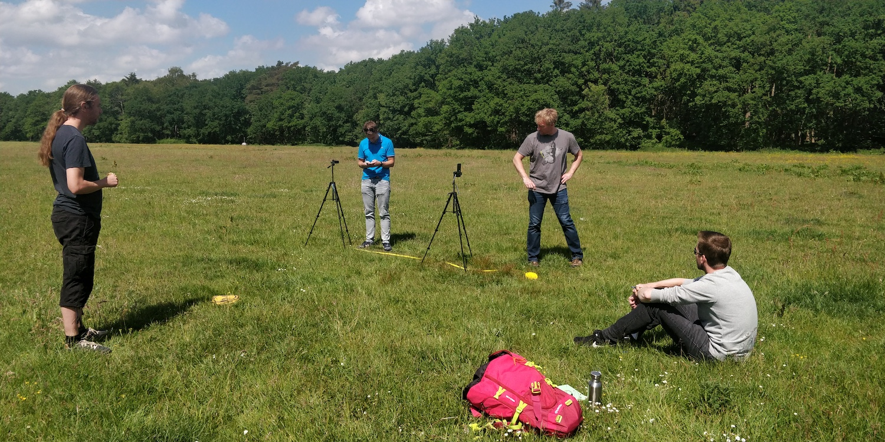

# = Apple Exposure Notification 'Lab Test' implementation =

# == Disclaimer ==
This repository contains a bare bones, technical implementation of the Google/Apple Exposure Notification protocol. It is intended to validate the technical underpinnings of the protocol and to conduct experiments and tests to test the accuracy of the protocol and/or the Bluetooth Low Energy readings.

It is NOT intended for end users and does NOT implement any security or privacy measures. In fact, to be able to analyze the protocol, the apps may exchange TEK keys at will. TEKs in this app have no relationship to COVID testing.

Although we always welcome contributions in the project, note that we consider this app a 'disposable' and it will not be actively maintained. (A separate repository will be published with the actual proof of concept app for the Dutch exposure notification implementation).

Keep in mind that the Apple Exposure Notification API is only accessible by verified health
authorities. Other devices trying to access the API using the code in this repository will fail
to do so.

# == Instructions ==

Please create a file called `Config.xcconfig` with the following content to build this project:

`APPCENTER_API_KEY = Your key`

Microsoft App Center being used for statistics and crash logging for this lab test only!

# == Impression of experiment ==

